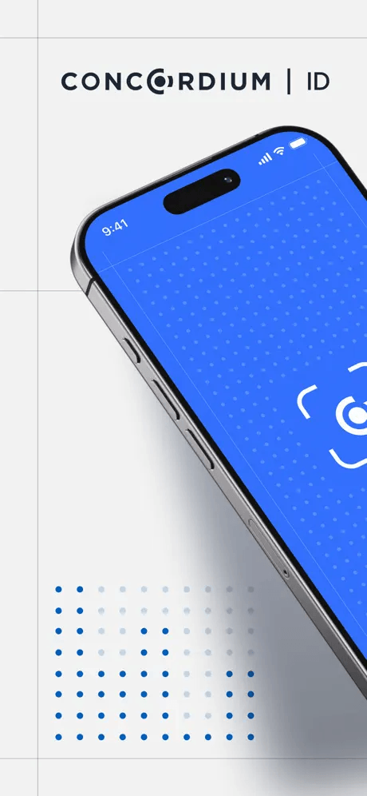
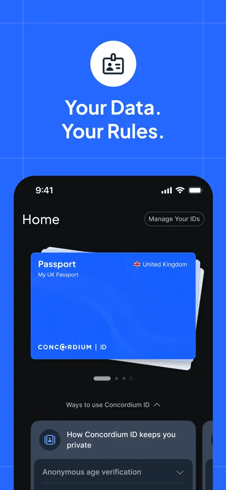

  
TL;DR

  
Concordium's identity layer is cryptographically brilliant and also hard to use. We distilled it into a dedicated ID app: verify once, hold your credential on your own device, and prove facts like "over 18" with zero-knowledge proofs — revealing nothing else. Researched, prototyped, and launched within a year.

## Background: a blockchain with a complex identity layer

Concordium is a public layer-1 blockchain with a rare design decision at its
core: identity is built into the protocol itself. Founded in 2018 by Lars
Seier Christensen, co-founder of Saxo Bank, its science was developed with
leading cryptographers — among them Ivan Damgård (Aarhus University's COBRA
research centre) and Ueli Maurer (ETH Zurich).

Every participant on the network verifies their real-world identity with an
identity provider before opening an account — a full KYC check. In the web3
world this is an anti-pattern: users expect to generate a keypair and join a
network in seconds, anonymously. Concordium instead sits closer to the
existing financial system, where identity verification is the price of
regulatory compliance and fraud prevention.

The counterweight is privacy. Concordium was designed from the ground up so
that verified identity never touches the chain: accounts link to a user's
identity credential through zero-knowledge proofs, personal data stays off-chain,
and anonymity can only be lifted through a regulated legal process. It is a
genuinely elegant construction — and precisely because of that strong
commitment to privacy, managing identity credentials is technically
constrained and cumbersome for ordinary users. The cryptography solved the
hard problem; the experience of using it remained a deep product problem.

## Solution: a dedicated ID app

The answer was to lift the identity lifecycle out of the wallet and into a
standalone, self-custodial app for iOS and Android: Concordium ID. You verify
once with a trusted identity provider, receive a private cryptographic
credential stored only on your device, and from there create on-chain accounts
or answer verification requests — scan a QR code, approve a proof, done. Via
WalletConnect, third-party and multi-chain wallets can plug into Concordium's
identity layer without building any of it natively.

<figure class="ci-shots">

<figcaption>Credentials live on the device as cards you hold, not accounts you
log into; proving something is a scan away.</figcaption>
</figure>

The key feature: selective disclosure. The app can prove a single fact about
you — over 18, a citizen, not a resident of a given country — while concealing
every other personal identifier, provably. You verify once, then re-authenticate
anywhere in seconds with a QR scan, instead of repeating document checks across
every web2 and web3 platform. No document upload per service, no central
honeypot of personal data.

Two architectural decisions did a lot of the heavy lifting. First, the app
deliberately isolates identity keys from financial transaction-signing keys —
a clean separation of funds and identity that strengthens security and makes
features like cloud backup of credentials possible (and why importing a seed
phrase from a money wallet into the ID app is firmly discouraged). Second,
the app ships with an SDK, so the integration cost of Concordium's identity
layer moves out of every wallet and into one dedicated application —
third-party wallets get identity verification and account creation almost for
free.

Getting the experience right mattered as much as the cryptography, because
provable is not the same as believable. I ran the design department through a
fast 0-to-1 process: prototypes built with AI in days, then tested the same
week in London with non-technical people who owed our claims nothing. Three
findings shaped the product:

- **Privacy you can see beats privacy you're promised.** People don't weigh a
  privacy claim; they watch what the app does. So each screen shows exactly
  what is shared — and nothing else.
- **Explaining "zero-knowledge proofs" spent trust rather than building it.**
  An unfamiliar term reads as something to take on faith. We cut the jargon
  and showed a plain promise with a simple visual instead.
- **What feels appropriate is set by the moment, not the feature.** The same
  disclosure felt safe in one context and intrusive in another, so each
  proving moment asks only for what it genuinely warrants.

## Launch and success story

Concordium ID shipped to the App Store and Google Play in August 2025 —
researched, prototyped, built, and launched within the year. Its debut use
case took aim at one of the internet's most visible identity failures: age
verification, which regulators increasingly demand and which most services
solve by hoarding copies of passports. The timing was no accident: the UK
Online Safety Act, the EU's MiCA framework with its AML/KYC obligations, and
age-verification mandates landing on social platforms all point the same way —
identity checks are becoming unavoidable, and the question is whether they
happen privately or by uploading your passport to yet another database.

The launch came with real distribution, and validated both integration paths
the architecture was designed for. Coin98, a multi-chain wallet with millions
of users, adopted the ID app directly for account creation and identity
verification — cutting its integration time dramatically because the app
carries the whole identity lifecycle. Other wallets, like SafePal, chose the
opposite route and integrated Concordium's full suite natively. For
businesses, verification events can be anchored on-chain as encrypted
digests — an audit trail that satisfies regulators without exposing any raw
personal data.

We launched with a deliberate three-step roadmap, introduced to the community
in a live AMA and walkthrough I hosted with product manager Arjun Yadav:

- **V1 — wallet onboarding.** Account creation and initial identity
  verification for third-party wallets: the integration problem, solved first.
- **V2 — simplified UX and attribute proofs.** Frictionless onboarding that
  abstracts seed phrases away, plus zero-knowledge age checks.
- **V3 — privacy-first UX and "verify & pay".** A private, incognito-style
  experience, and combining age-gated compliance with stablecoin payments via
  protocol-level tokens in a single flow.

Fully non-custodial, with no user data collected by the developer, the app has
kept growing with the community since launch — supported by community testing
programmes for each release and planned onboarding incentives. A portable,
reusable, privacy-first ID for both web2 and web3 services, and proof that
deep cryptography can feel simple.
