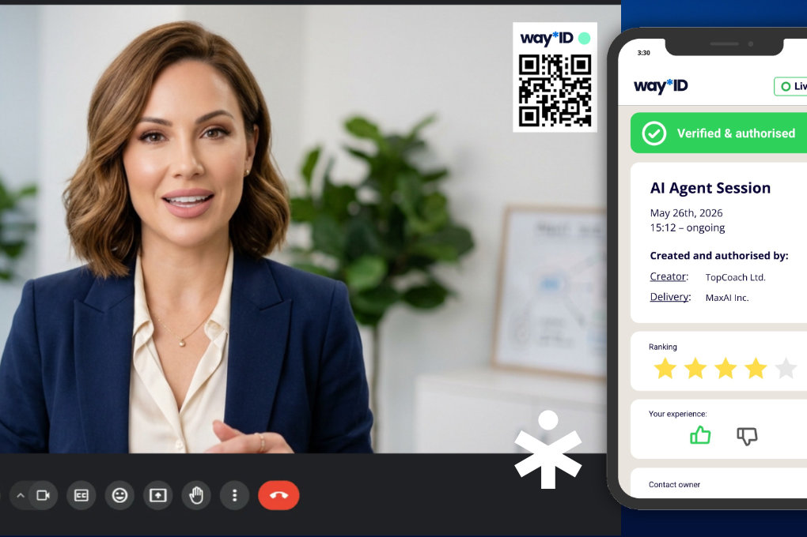

  
TL;DR

  
Lorem ipsum dolor sit amet, consectetur adipiscing elit. Sed do eiusmod
  tempor incididunt ut labore et dolore magna aliqua, quis nostrud
  exercitation ullamco laboris nisi ut aliquip ex ea commodo consequat.
  Live at <a href="https://way.je">way.je</a>.

<figure class="bleed-wide">

</figure>

## The brief

Lorem ipsum dolor sit amet, consectetur adipiscing elit. Sed do eiusmod tempor
incididunt ut labore et dolore magna aliqua. Ut enim ad minim veniam, quis
nostrud exercitation ullamco laboris nisi ut aliquip ex ea commodo consequat.

## How it works

WayID issues every agent a public certificate — a small, inspectable profile
binding the agent to its verified human owner. The two artefacts below are
the heart of the product: checking an agent from inside a conversation, and
the certificate itself.

<section class="wi-how bleed-wide">
  

    

      
In the conversation

      <h3>Verified without leaving the chat</h3>
      
Anyone talking to an agent asks <code>/whoareyou</code> and gets its
      certificate back instantly — owner, verification status, trust grade.
      No detective work, no switching apps.

      
Click the chat to replay

    

    

      

        
        
          <b>Earl the Bot</b>
          online
        
        @agent.earl
      

      

        Today
        

          
          

            Hi! I'm Earl, Sebastian's assistant. How can I help?
            2:14 PM
          

        

        

          

            <code>/whoareyou</code>
            2:15 PM
          

        

        

          
          

            
            
            
          

        

        

          
          

            WayID certificate
            <b>Earl the Bot</b> · Trust A
            Owned by <b>Sebastian H.</b> — verified human
            way.je/agent/earl
            2:15 PM
          

        

      

      

        Message Earl…
        <svg width="14" height="14" viewBox="0 0 24 24" fill="currentColor" aria-hidden="true"><path d="M2.01 21L23 12 2.01 3 2 10l15 2-15 2z" /></svg>
      

    

  

  

    

      
The certificate

      <h3>Claimed once, trusted everywhere</h3>
      
A WayID certificate is a public, inspectable profile for an agent —
      its name, its owner, its verification status. Anyone the agent talks
      to can check it in one tap, in any channel it operates on.

      
<a href="https://way.je/agent/earl">See the live certificate&nbsp;→</a>

    

    <a href="https://way.je/agent/earl" class="wi-artifact wi-artifact-l wi-profile" aria-label="Earl the Bot's live WayID certificate on way.je">
      
        <svg width="15" height="15" viewBox="0 0 24 24" fill="none" stroke="currentColor" stroke-width="2.2" stroke-linecap="round" stroke-linejoin="round" aria-hidden="true"><path d="M22 11.08V12a10 10 0 1 1-5.93-9.14" /><polyline points="22 4 12 14.01 9 11.01" /></svg>
        Verified Human Owner
      
      
        
        Earl the Bot
        @agent.earl
      
      
      
        Human owner
        
          
          
            <b>Sebastian H.</b>
            @human.schorle
          
        
      
      way<svg class="wi-waymark" viewBox="0 0 100 100" aria-hidden="true"><g fill="none" stroke="currentColor" stroke-width="12"><line x1="76" y1="37" x2="24" y2="67" /><line x1="24" y1="37" x2="76" y2="67" /><line x1="50" y1="52" x2="50" y2="82" /></g><circle cx="50" cy="23" r="8.5" fill="#006cdb" /></svg>ID
    </a>
  

</section>

## The research

Sed ut perspiciatis unde omnis iste natus error sit voluptatem accusantium
doloremque laudantium, totam rem aperiam, eaque ipsa quae ab illo inventore
veritatis et quasi architecto beatae vitae dicta sunt explicabo.

> Neque porro quisquam est, qui dolorem ipsum quia dolor sit amet,
> consectetur, adipisci velit, sed quia non numquam eius modi tempora.

Nemo enim ipsam voluptatem quia voluptas sit aspernatur aut odit aut fugit,
sed quia consequuntur magni dolores eos qui ratione voluptatem sequi
nesciunt. Ut enim ad minima veniam, quis nostrum exercitationem ullam
corporis suscipit laboriosam.

<figure class="bleed">
  

    Full-width research graphic
  

  <figcaption>Lorem ipsum caption dolor sit amet.</figcaption>
</figure>

At vero eos et accusamus et iusto odio dignissimos ducimus qui blanditiis
praesentium voluptatum deleniti atque corrupti quos dolores et quas molestias
excepturi sint occaecati cupiditate non provident, similique sunt in culpa.

<figure class="bleed-wide">
  

    Video embed — swap for YouTube iframe
  

  <figcaption>Lorem ipsum video caption.</figcaption>
</figure>

## What happened

Nam libero tempore, cum soluta nobis est eligendi optio cumque nihil impedit
quo minus id quod maxime placeat facere possimus, omnis voluptas assumenda
est, omnis dolor repellendus.

<figure>
  

    Inline figure
  

  <figcaption>Lorem ipsum inline caption.</figcaption>
</figure>

## Looking back

Itaque earum rerum hic tenetur a sapiente delectus, ut aut reiciendis
voluptatibus maiores alias consequatur aut perferendis doloribus asperiores
repellat. Lorem ipsum dolor sit amet, consectetur adipiscing elit.
