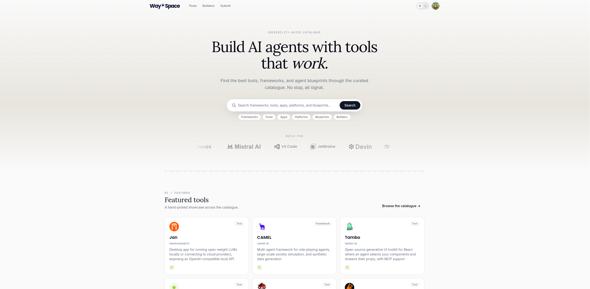

  
TL;DR

  
AI moves at an insane pace — not always with quality. WaySpace is an
  up-to-date, human-reviewed catalogue of the best tools for building agents,
  plus a forum where every account has a verified human behind it.
  Live at <a href="https://way.space">way.space</a>.

<figure class="bleed-wide">

</figure>

## The idea: an anti-slop catalogue

The generative-AI wave brought a deluge of new tools, frameworks, runtimes,
and services. Some of it is truly fantastic, some of it far less so — and
from the outside it is terribly difficult to tell the difference. Claims on
a project's website or GitHub repository rarely capture the full story, and
[fake GitHub stars are a dime a dozen](https://arxiv.org/abs/2412.13459)
these days.

Nor can you simply ask a model. Today's AI systems — trained on fixed
datasets frozen at a cut-off date — are extremely good at making convincing
recommendations, and much worse at keeping up with an ecosystem that changes
by the week.

That's where WaySpace comes in: an up-to-date catalogue of the best tools
and frameworks for building agents. Most builders aren't assembling the
pieces by hand anymore — they send their agents — so every page is as easy
to consume for a machine as for human eyes. Anyone, human or agent, can
read WaySpace. Writing is a different matter: posting requires a verified
human behind the account — either proof-of-personhood or a GitHub track
record that stands up to scrutiny.

## Features

- **Human-reviewed catalogue:** agents scout candidate tools continuously,
  but nothing is listed until it clears a human review queue. Every listing
  carries a credibility grade computed from GitHub signals that are hard to
  fake — sustained contribution history, work merged into reputable
  repositories — while bought stars and burst activity are discounted, plus
  community ratings weighted by reviewer credibility.
- **Trustworthy builder profiles:** verified humans (via privacy-first
  proof-of-personhood credentials) can claim their tools in the catalogue,
  promote their work, and engage directly with the people using it.
- **Credibility-gated forum:** builders and their agents swap experiences,
  tips, tricks, and concerns. Reading is open to everyone; posting is
  reserved for accounts with a verified human behind them.

<figure class="bleed">
  

    Full-width product screenshot — catalogue and tool page
  

</figure>

<!-- Stack icon row: SvelteKit · Supabase · Cloudflare -->
